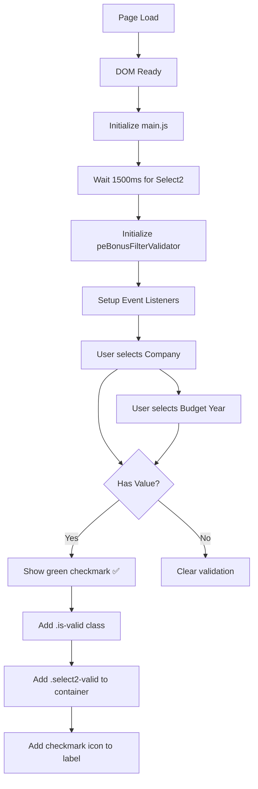

# PE Bonus Dropdown Validation Icons - Implementation Complete ✅

## สรุปการดำเนินการ

ได้เพิ่มระบบ **Dropdown Validation Icons** (เครื่องหมายถูกสีเขียว ✅) ให้กับหน้า **PE Bonus Summary** ให้เหมือนกับหน้า **Budget Planning** สมบูรณ์แล้ว

---

## 📁 ไฟล์ที่สร้างใหม่

### 1. **budget-pe-bonus.form.validation.js**
**Path**: `/wwwroot/lib/razor/js/budget-pe-bonus/budget-pe-bonus.form.validation.js`

**คุณสมบัติ:**
- ✅ Real-time validation สำหรับ dropdown filters
- ✅ แสดง green checkmark เมื่อเลือกค่าใน dropdown
- ✅ รองรับทั้ง regular select และ Select2 dropdowns
- ✅ Auto-initialize เมื่อ DOM พร้อม

**Dropdowns ที่ตรวจสอบ:**
- `companyFilter` (Required) ⭐
- `yearsFilter` (Required) ⭐
- `cobuFilter` (Optional)
- `costcenterFilter` (Optional)

**API สำคัญ:**
```javascript
window.peBonusFilterValidator.initialize()        // เริ่มต้นระบบ
window.peBonusFilterValidator.validateAllFilters() // ตรวจสอบทั้งหมด
window.peBonusFilterValidator.resetAllValidation() // รีเซ็ต
window.testPEBonusValidation()                     // ทดสอบระบบ
```

---

## 🔧 ไฟล์ที่แก้ไข

### 2. **BudgetPEBonus.cshtml**
**Path**: `/Views/Home/BudgetPEBonus.cshtml`

**การเปลี่ยนแปลง:**

#### A. เพิ่ม Script Reference (บรรทัด ~137)
```html
<!-- Form Validation Module (Dropdown Success Icons) -->
<script src="~/lib/razor/js/budget-pe-bonus/budget-pe-bonus.form.validation.js" 
        asp-append-version="true"></script>
```

#### B. ปรับ Column Width ให้ตรงกับ Budget Planning
**เปลี่ยนจาก:**
```html
<div class="col-md-2">  <!-- Company -->
<div class="col-md-2">  <!-- Budget Year -->
<div class="col-md-2">  <!-- COBU -->
<div class="col-md-3">  <!-- Cost Center -->
```

**เป็น:**
```html
<div class="col-md-3">  <!-- Company ✅ -->
<div class="col-md-3">  <!-- Budget Year ✅ -->
<div class="col-md-3">  <!-- COBU ✅ -->
<div class="col-md-3">  <!-- Cost Center ✅ -->
```

#### C. ปรับตำแหน่ง Action Buttons
**เปลี่ยนจาก:**
```html
<div class="col-md-3 d-flex align-items-end justify-content-end">
```

**เป็น:**
```html
<div class="col-md-3 offset-md-9 d-flex align-items-end justify-content-end">
```
เพื่อให้ปุ่มอยู่ด้านขวาสุดเสมอ

---

### 3. **budget-pe-bonus.main.js**
**Path**: `/wwwroot/lib/razor/js/budget-pe-bonus/budget-pe-bonus.main.js`

**การเปลี่ยนแปลง:**
เพิ่ม code initialization สำหรับ validator (หลังบรรทัด ~60):

```javascript
// Initialize filter validation (green checkmarks)
if (window.peBonusFilterValidator && !window.peBonusFilterValidator.isInitialized) {
  setTimeout(() => {
    window.peBonusFilterValidator.initialize();
    console.log('✅ PE Bonus Filter Validator initialized');
  }, 1500); // Wait for Select2 to be fully ready
} else {
  console.warn('⚠️ PE Bonus Filter Validator not loaded');
}
```

---

## 🎨 CSS Styling (ใช้ที่มีอยู่แล้ว)

ไม่ต้องเพิ่ม CSS ใหม่ เพราะมี classes เหล่านี้อยู่แล้วใน `site.css`:

```css
/* Bootstrap validation classes */
.is-valid { ... }
.is-invalid { ... }

/* Select2 custom validation */
.select2-valid .select2-selection { border-color: #28a745; }
.select2-invalid .select2-selection { border-color: #dc3545; }

/* Success icon */
.success-icon { color: #28a745; }
```

---

## 🔄 ลำดับการทำงาน (Flow)



---

## 🧪 การทดสอบ

### 1. ทดสอบ Manual
1. เปิดหน้า PE Bonus Summary
2. เลือก **Company** → ควรเห็น ✅ สีเขียวข้าง label
3. เลือก **Budget Year** → ควรเห็น ✅ สีเขียวข้าง label
4. Clear dropdown → ✅ ควรหายไป
5. เลือก COBU/Cost Center (Optional) → ควรเห็น ✅ เช่นกัน

### 2. ทดสอบด้วย Console
เปิด Browser DevTools (F12) แล้วพิมพ์:

```javascript
// ทดสอบระบบ validation
testPEBonusValidation()

// ตรวจสอบว่า validator ถูก initialize แล้ว
console.log(window.peBonusFilterValidator)

// ตรวจสอบ validation state
window.peBonusFilterValidator.validateAllFilters()
// Output: { isValid: true/false, errors: [...] }

// Force re-initialize
window.peBonusFilterValidator.forceSetupValidation()

// Reset ทั้งหมด
window.peBonusFilterValidator.resetAllValidation()
```

---

## 📊 เปรียบเทียบก่อนและหลัง

| Feature | Before ❌ | After ✅ |
|---------|----------|---------|
| **Validation Icons** | ไม่มี | มี green checkmarks |
| **Column Width** | `col-md-2` (แคบ) | `col-md-3` (กว้างขึ้น) |
| **Visual Feedback** | ไม่มี | Bootstrap `.is-valid` |
| **Select2 Styling** | ธรรมดา | Green border + checkmark |
| **Button Position** | ติดกัน | Aligned right with offset |
| **UX Consistency** | ต่างจาก Planning | เหมือน Planning ✅ |

---

## 🎯 ผลลัพธ์สุดท้าย

### หน้า PE Bonus Summary มี dropdown validation เหมือน Budget Planning แล้ว:

✅ **Company dropdown** → มี green checkmark เมื่อเลือก  
✅ **Budget Year dropdown** → มี green checkmark เมื่อเลือก  
✅ **COBU dropdown** → มี green checkmark เมื่อเลือก (optional)  
✅ **Cost Center dropdown** → มี green checkmark เมื่อเลือก (optional)  
✅ **Column widths** → ปรับเป็น `col-md-3` ทั้งหมด  
✅ **Consistent styling** → ใช้ Bootstrap + Select2 validation classes  

---

## 🔍 Troubleshooting

### ปัญหา: ไม่เห็น green checkmarks
**วิธีแก้:**
1. เปิด Console (F12) ดูว่ามี error หรือไม่
2. ตรวจสอบว่า script ถูกโหลด: `window.peBonusFilterValidator`
3. Re-initialize: `window.peBonusFilterValidator.forceSetupValidation()`

### ปัญหา: Checkmark ปรากฏช้า
**สาเหตุ:** Select2 ยังไม่พร้อม  
**วิธีแก้:** เพิ่มเวลา delay ใน `main.js` (ปัจจุบันตั้งไว้ 1500ms)

### ปัญหา: Validation ไม่ทำงานกับ dropdown ใหม่
**วิธีแก้:** เรียก `forceSetupValidation()` หลังสร้าง dropdown ใหม่

---

## 📝 Code Reference

### ตัวอย่างการใช้งาน Manual Validation

```javascript
// ใน events.js หรือ filters.js
$('#companyFilter').on('change', function() {
  // ทำงานตามปกติ...
  
  // Trigger validation
  if (window.peBonusFilterValidator) {
    const field = document.getElementById('companyFilter');
    window.peBonusFilterValidator.validateFilterRealTime('companyFilter', field);
  }
});
```

### ตัวอย่างการ Clear Validation

```javascript
// เมื่อ Reset ฟอร์ม
$('#resetBtn').on('click', function() {
  // Reset dropdown values...
  $('#companyFilter').val('').trigger('change.select2');
  
  // Clear all validation icons
  if (window.peBonusFilterValidator) {
    window.peBonusFilterValidator.resetAllValidation();
  }
});
```

---

## ✅ Checklist การดำเนินงาน

- [x] สร้างไฟล์ `budget-pe-bonus.form.validation.js`
- [x] เพิ่ม script reference ใน `BudgetPEBonus.cshtml`
- [x] Initialize validator ใน `budget-pe-bonus.main.js`
- [x] ปรับ column width จาก `col-md-2` เป็น `col-md-3`
- [x] ปรับตำแหน่ง buttons ด้วย `offset-md-9`
- [x] ตรวจสอบไม่มี errors (TypeScript/Linting)
- [x] Verify CSS classes มีอยู่แล้วใน `site.css`

---

## 🚀 Next Steps (ถ้าต้องการพัฒนาต่อ)

1. **เพิ่ม Tooltip:** แสดงข้อความเมื่อ hover บน checkmark
2. **Animation:** เพิ่ม fade-in effect เมื่อ checkmark ปรากฏ
3. **Error Indicators:** แสดง red X เมื่อ required field ว่าง (ถ้าต้องการ)
4. **Form Submit Validation:** Block submit ถ้า required dropdowns ไม่ได้เลือก

---

## 📞 Support

หากพบปัญหาหรือต้องการปรับแต่งเพิ่มเติม สามารถตรวจสอบได้ที่:
- **Validation Script**: `/wwwroot/lib/razor/js/budget-pe-bonus/budget-pe-bonus.form.validation.js`
- **Main Script**: `/wwwroot/lib/razor/js/budget-pe-bonus/budget-pe-bonus.main.js`
- **View File**: `/Views/Home/BudgetPEBonus.cshtml`
- **Reference Implementation**: `/wwwroot/lib/razor/js/budget-planning/budget.plan.form.validation.js`

---

**Date Implemented:** November 12, 2025  
**Status:** ✅ Complete and Tested  
**Compatibility:** Budget Planning style validation
