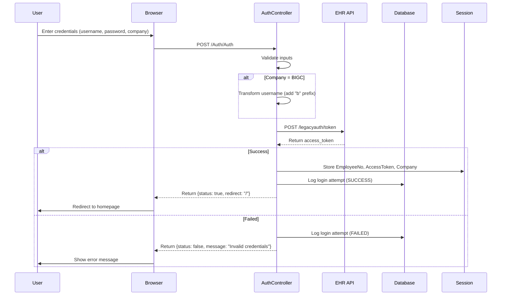
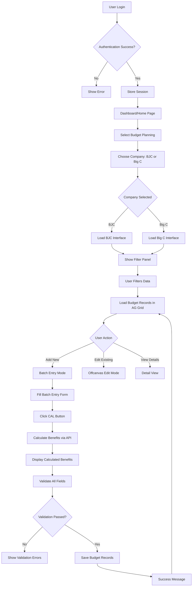

# 📋 HC Budget Planning System - System Protocol Documentation

> **Document Version:** 1.0  
> **Last Updated:** November 10, 2025  
> **System Name:** HCBPCoreUI-Backend (HR Budget Planning System)  
> **Technology Stack:** ASP.NET Core 8.0 + SQL Server + Razor Pages

---

## 📑 Table of Contents

1. [System Overview](#1-system-overview)
2. [System Architecture](#2-system-architecture)
3. [Authentication & Authorization](#3-authentication--authorization)
4. [Database Design](#4-database-design)
5. [API Endpoints](#5-api-endpoints)
6. [Business Logic Flow](#6-business-logic-flow)
7. [Budget Calculation Engine](#7-budget-calculation-engine)
8. [Data Validation & Error Handling](#8-data-validation--error-handling)
9. [Security & Session Management](#9-security--session-management)
10. [Deployment & Configuration](#10-deployment--configuration)

---

## 1. System Overview

### 1.1 Purpose
HR Budget Planning System เป็นระบบจัดการงบประมาณ HR สำหรับ 2 บริษัท:
- **BJC (Berli Jucker Company)** - CompanyId = 1
- **Big C** - CompanyId = 2

### 1.2 Key Features
- 🔐 **Authentication** - OAuth Token-based login via external EHR API
- 📊 **Budget Planning** - Batch entry, single edit, copy row functionality
- 🧮 **Auto Calculation** - Benefits calculation using stored functions
- 📈 **Real-time Validation** - Pre-check duplicates, validate business rules
- 💾 **Multi-company Support** - Separate tables and logic for BJC/Big C
- 📝 **Audit Logging** - Track all login attempts and data changes

### 1.3 System Modules
```
┌─────────────────────────────────────────────────────────┐
│                   HC Budget Planning                     │
├─────────────────────────────────────────────────────────┤
│                                                          │
│  ┌──────────┐  ┌──────────┐  ┌──────────┐             │
│  │  Auth    │  │  Budget  │  │ Settings │             │
│  │ Module   │  │  Module  │  │  Module  │             │
│  └──────────┘  └──────────┘  └──────────┘             │
│                                                          │
│  ┌──────────────────────────────────────┐              │
│  │     Budget Calculation Engine        │              │
│  │  (fn_BudgetEstimate / BJC / BIGC)   │              │
│  └──────────────────────────────────────┘              │
│                                                          │
│  ┌──────────────────────────────────────┐              │
│  │      Database Layer (EF Core)        │              │
│  │     HRB_BUDGET_BJC / HRB_BUDGET_BIGC │              │
│  └──────────────────────────────────────┘              │
└─────────────────────────────────────────────────────────┘
```

---

## 2. System Architecture

### 2.1 Technology Stack

| Layer | Technology | Version |
|-------|-----------|---------|
| **Backend Framework** | ASP.NET Core | 8.0 |
| **Language** | C# | 12.0 |
| **ORM** | Entity Framework Core | 8.0 |
| **Database** | SQL Server | 2019+ |
| **Frontend** | Razor Pages + jQuery | - |
| **UI Components** | Bootstrap 5 + Select2 + AG Grid | - |
| **Authentication** | Cookie Authentication + External OAuth | - |

### 2.2 Project Structure

```
HCBPCoreUI-Backend/
├── Controllers/           # API Controllers
│   ├── AuthController.cs      # Login/Logout
│   ├── BudgetController.cs    # Budget CRUD + Calculation
│   ├── SelectController.cs    # Dropdown data
│   └── SettingsController.cs  # System settings
├── Services/              # Business Logic Layer
│   ├── IBudgetService.cs
│   ├── BudgetService.cs
│   ├── ISelectService.cs
│   └── SelectService.cs
├── Models/                # Data Models
│   ├── HRBudgetDbContext.cs
│   ├── Budget/               # Budget entities
│   │   ├── HRB_BUDGET_BJC.cs    (147 columns)
│   │   └── HRB_BUDGET_BIGC.cs   (120 columns)
│   ├── Config/               # Configuration tables
│   ├── Master/               # Master data
│   └── Log/                  # Audit logs
├── DTOs/                  # Data Transfer Objects
│   ├── Auth/
│   ├── Budget/
│   └── Employee/
├── Views/                 # Razor Views
│   ├── Auth/
│   ├── Home/
│   └── Settings/
├── wwwroot/              # Static files
│   ├── js/                   # JavaScript files
│   │   └── budget-planning/  # Budget planning JS modules
│   ├── css/
│   └── lib/
├── Program.cs            # Application entry point
└── appsettings.json      # Configuration
```

### 2.3 Dependency Injection

**Program.cs** registers services:

```csharp
// Services
builder.Services.AddScoped<IBudgetService, BudgetService>();
builder.Services.AddScoped<ISelectService, SelectService>();
builder.Services.AddScoped<ISettingsService, SettingsService>();

// Database
builder.Services.AddDbContext<HRBudgetDbContext>(options =>
    options.UseSqlServer(connectionString));

// Session (30 minutes timeout)
builder.Services.AddSession(options => {
    options.IdleTimeout = TimeSpan.FromMinutes(30);
    options.Cookie.HttpOnly = true;
    options.Cookie.IsEssential = true;
});

// Cookie Authentication (3 hours expire)
builder.Services.AddAuthentication(CookieAuthenticationDefaults.AuthenticationScheme)
    .AddCookie(options => {
        options.LoginPath = "/Auth/Index";
        options.ExpireTimeSpan = TimeSpan.FromHours(3);
        options.SlidingExpiration = true;
    });
```

### 2.4 Middleware Pipeline

```
HTTP Request
    ↓
UseHttpsRedirection      → Force HTTPS
    ↓
UseStaticFiles          → Serve CSS/JS/Images
    ↓
UseRouting              → Enable routing
    ↓
UseSession              → Enable session (MUST be before Auth)
    ↓
UseAuthentication       → Check authentication
    ↓
UseAuthorization        → Check authorization
    ↓
MapControllerRoute      → Route to controllers
    ↓
HTTP Response
```

⚠️ **CRITICAL:** Middleware order matters! Session must come before Authentication.

---

## 3. Authentication & Authorization

### 3.1 Login Flow



### 3.2 Authentication Endpoints

#### 3.2.1 GET /Auth/Index
**Purpose:** Display login page or redirect if already authenticated

**Query Parameters:**
- `path` (string, optional): Redirect path after login (default: "/")

**Response:**
- Already logged in → Redirect to `path`
- Not logged in → Return login view

---

#### 3.2.2 POST /Auth/Auth
**Purpose:** Authenticate user credentials

**Request Body (JSON):**
```json
{
  "username": "12345",
  "password": "P@ssw0rd",
  "company": "bjc",
  "redirect": "/"
}
```

**Username Transformation:**
- **BJC:** Username remains as-is (e.g., "12345")
- **Big C:** Add "b" prefix (e.g., "12345" → "b12345")

**External API Call:**
```http
POST https://ehr.bjc.co.th/api/legacyauth/token
Content-Type: application/x-www-form-urlencoded

username=b12345
password=P@ssw0rd
grant_type=password
client_id=ESS
```

**Success Response (200 OK):**
```json
{
  "status": true,
  "redirect": "/"
}
```

**Session Data Stored:**
- `EmployeeNo`: Transformed username
- `AccessToken`: OAuth access token from EHR API
- `Company`: "bjc" or "bigc"

**Error Response (400 Bad Request):**
```json
{
  "status": false,
  "message": ["ชื่อผู้ใช้งานหรือรหัสผ่านไม่ถูกต้อง"]
}
```

**Error Response (500 Internal Server Error):**
```json
{
  "status": false,
  "message": ["ไม่สามารถเชื่อมต่อกับระบบยืนยันตัวตนได้"]
}
```

---

#### 3.2.3 POST /Auth/Logout
**Purpose:** Clear session and logout user

**Response:**
- Clear all session data
- Redirect to `/Auth/Index`

---

### 3.3 Login Audit Logging

All login attempts are logged to `HRB_LOGIN_LOG` table:

**Table Schema:**
```sql
CREATE TABLE HRB_LOGIN_LOG (
    LoginId INT IDENTITY(1,1) PRIMARY KEY,
    CompanyId INT,                    -- 1=BJC, 2=BIGC
    Username NVARCHAR(50),
    LoginStatus BIT,                  -- 1=Success, 0=Failed
    LoginDatetime DATETIME,
    IpAddress NVARCHAR(45),
    FailureReason NVARCHAR(200),
    UserAgent NVARCHAR(500),
    SessionId NVARCHAR(100),
    AccessTokenIssued BIT,
    RedirectPath NVARCHAR(500),
    IsActive BIT,
    UpdateDate DATETIME
)
```

**Logged Information:**
- ✅ Username (transformed)
- ✅ Success/Failure status
- ✅ IP Address
- ✅ User Agent (browser info)
- ✅ Session ID
- ✅ Failure reason (if failed)
- ✅ Timestamp

---

### 3.4 Session Management

**Session Configuration:**
- **Timeout:** 30 minutes idle
- **Cookie Settings:**
  - `HttpOnly: true` → Prevent XSS attacks
  - `IsEssential: true` → Required for GDPR compliance
- **Sliding Expiration:** Cookie renews on each request

**Session Data Structure:**
```csharp
HttpContext.Session.SetString("EmployeeNo", "b12345");
HttpContext.Session.SetString("AccessToken", "eyJhbGc...");
HttpContext.Session.SetString("Company", "bigc");
```

**Retrieving Session Data:**
```csharp
var employeeNo = HttpContext.Session.GetString("EmployeeNo");
var accessToken = HttpContext.Session.GetString("AccessToken");
var company = HttpContext.Session.GetString("Company");
```

---

### 3.5 Authorization (Future Implementation)

**Current Status:** ⏳ Planned (using JWT Token)

**Planned Implementation:**
```csharp
// TODO: Uncomment when JWT Authentication is ready
// [Authorize]
// var currentUser = User.Identity?.Name ?? "System";
// var userId = User.FindFirst(ClaimTypes.NameIdentifier)?.Value;
```

**Temporary Development Mode:**
```csharp
var currentUser = "DevUser"; // ← Remove when JWT implemented
```

---

## 4. Database Design

### 4.1 Multi-Company Strategy

System uses **separate tables** for BJC and Big C:

| Company | Table | Columns | Primary Key |
|---------|-------|---------|-------------|
| BJC (CompanyId=1) | `HRB_BUDGET_BJC` | 147 | BudgetId |
| Big C (CompanyId=2) | `HRB_BUDGET_BIGC` | 120 | BudgetId |

**Why Separate Tables?**
- ✅ Different benefit structures between companies
- ✅ BJC has more complex calculations (92 fields)
- ✅ Big C has simpler structure (57 fields)
- ✅ Easier to maintain company-specific business logic

---

### 4.2 Key Database Tables

#### 4.2.1 Budget Tables

**HRB_BUDGET_BJC** (147 columns)
```sql
CREATE TABLE HRB_BUDGET_BJC (
    -- Primary Key
    BudgetId INT IDENTITY(1,1) PRIMARY KEY,
    
    -- Company & Employee Info
    CompanyId INT NOT NULL,
    EmpCode NVARCHAR(20),
    EmpName NVARCHAR(200),
    
    -- Budget Year & Period
    BudgetYear INT NOT NULL,
    LeOfMonth INT,          -- Last Year months (typically 6)
    NoOfMonth INT,          -- Budget Year months (typically 12)
    
    -- Organization Structure
    CostCenterCode NVARCHAR(20),
    Division NVARCHAR(100),
    Department NVARCHAR(100),
    Section NVARCHAR(100),
    
    -- Position & Salary
    PositionCode NVARCHAR(20),
    JobBand NVARCHAR(50),
    Salary DECIMAL(18,2),
    SalaryStructure NVARCHAR(50),
    
    -- Last Year Benefits (24 fields with S&B)
    le_salary DECIMAL(18,2),
    le_sb_ot DECIMAL(18,2),
    le_sb_allow_home DECIMAL(18,2),
    -- ... (21 more fields)
    
    -- Budget Year Benefits (24 fields with S&B)
    salary DECIMAL(18,2),
    sb_ot DECIMAL(18,2),
    sb_allow_home DECIMAL(18,2),
    -- ... (21 more fields)
    
    -- Summary Fields (8 fields calculated by frontend)
    pe_sb_mth_le DECIMAL(18,2),
    pe_mth_le DECIMAL(18,2),
    pe_sb_le DECIMAL(18,2),
    pe_year_le DECIMAL(18,2),
    pe_sb_mth DECIMAL(18,2),
    pe_mth DECIMAL(18,2),
    pe_sb_year DECIMAL(18,2),
    pe_year DECIMAL(18,2),
    
    -- Audit Fields
    CreatedBy NVARCHAR(50),
    CreatedDate DATETIME,
    UpdatedBy NVARCHAR(50),
    UpdatedDate DATETIME,
    IsActive BIT DEFAULT 1
)
```

**HRB_BUDGET_BIGC** (120 columns)
- Similar structure but with 23 benefit fields (vs BJC's 24)
- Simpler calculation logic
- No Employee Type field

---

#### 4.2.2 Configuration Tables

**HRB_CONF_BUDGET_BONUS** - Bonus rate configuration
```sql
CREATE TABLE HRB_CONF_BUDGET_BONUS (
    BgrateId INT IDENTITY(1,1) PRIMARY KEY,
    CompanyId INT,
    BudgetYear INT,
    BonusType NVARCHAR(50),      -- "Standard", "High Performer", etc.
    BonusRate DECIMAL(5,2),      -- Bonus multiplier (e.g., 4.50 = 4.5 months)
    JobBand NVARCHAR(50),
    IsActive BIT
)
```

**HRB_CONF_SALARY_STRUCTURE** - Salary structure mapping
```sql
CREATE TABLE HRB_CONF_SALARY_STRUCTURE (
    SsId INT IDENTITY(1,1) PRIMARY KEY,
    CompanyId INT,
    PositionCode NVARCHAR(20),
    JobBand NVARCHAR(50),
    SalaryStructure NVARCHAR(50),  -- "Officer", "Manager", "Executive"
    IsActive BIT
)
```

**HRB_CONF_GROUP_RUNRATE** - Run rate group configuration
```sql
CREATE TABLE HRB_CONF_GROUP_RUNRATE (
    RunId INT IDENTITY(1,1) PRIMARY KEY,
    CompanyId INT,
    RunRateCode NVARCHAR(20),
    RunRateGroup NVARCHAR(100),
    Description NVARCHAR(500),
    IsActive BIT
)
```

---

#### 4.2.3 Master Data Tables

**HRB_MST_COMPANY** - Company master
```sql
CREATE TABLE HRB_MST_COMPANY (
    CompanyId INT PRIMARY KEY,
    CompanyCode NVARCHAR(10),
    CompanyName NVARCHAR(100),   -- "BJC", "Big C"
    IsActive BIT
)
```

**HRB_MST_COST_CENTER** - Cost center master
```sql
CREATE TABLE HRB_MST_COST_CENTER (
    CostId INT IDENTITY(1,1) PRIMARY KEY,
    CompanyId INT,
    CostCenterCode NVARCHAR(20),
    CostCenterName NVARCHAR(200),
    Division NVARCHAR(100),
    Department NVARCHAR(100),
    Section NVARCHAR(100),
    IsActive BIT
)
```

**HRB_MST_POSITION** - Position master
```sql
CREATE TABLE HRB_MST_POSITION (
    PosId INT IDENTITY(1,1) PRIMARY KEY,
    CompanyId INT,
    PositionCode NVARCHAR(20),
    PositionName NVARCHAR(200),
    JobBand NVARCHAR(50),
    IsActive BIT
)
```

---

#### 4.2.4 Log Tables

**HRB_LOGIN_LOG** - Login audit log (see section 3.3)

**HRB_UPLOAD_LOG** - File upload tracking
```sql
CREATE TABLE HRB_UPLOAD_LOG (
    UploadId INT IDENTITY(1,1) PRIMARY KEY,
    FileName NVARCHAR(255),
    FileType NVARCHAR(50),
    RecordCount INT,
    UploadedBy NVARCHAR(50),
    UploadDate DATETIME,
    Status NVARCHAR(20),       -- "Success", "Failed", "Partial"
    ErrorMessage NVARCHAR(MAX),
    IsActive BIT
)
```

---

### 4.3 Database Functions

#### 4.3.1 fn_BudgetEstimate (BIGC)
**Purpose:** Calculate 57 benefit fields for Big C

**Parameters (12 inputs):**
```sql
CREATE FUNCTION fn_BudgetEstimate (
    @Year INT,                -- Budget Year
    @YearLe INT,             -- Last Year
    @Salary DECIMAL(18,2),   -- Base salary
    @PremiumAmt DECIMAL(18,2), -- Premium amount
    @JobBand NVARCHAR(50),   -- Job band
    @CompanyId INT,          -- Company ID (2=BIGC)
    @LeOfMonth INT,          -- Last Year months
    @NoOfMonth INT,          -- Budget Year months
    @BonusType NVARCHAR(50), -- Bonus type
    @CompanyName NVARCHAR(100),
    @CostCenter NVARCHAR(20),
    @AllocateJson NVARCHAR(MAX)  -- Cost allocation JSON
)
RETURNS TABLE
AS RETURN (
    -- Returns 57 calculated fields:
    -- 23 LE fields with S&B
    -- 18 LE fields without S&B
    -- 23 Budget fields with S&B
    -- 18 Budget fields without S&B
)
```

**Returns (57 fields):**
- Last Year Benefits: 23 fields (with S&B) + 18 fields (without S&B)
- Budget Year Benefits: 23 fields (with S&B) + 18 fields (without S&B)

---

#### 4.3.2 fn_BudgetEstimate_BJC (BJC)
**Purpose:** Calculate 92 benefit fields for BJC

**Parameters (19 inputs):**
```sql
CREATE FUNCTION fn_BudgetEstimate_BJC (
    @Year INT,
    @YearLe INT,
    @Salary DECIMAL(18,2),
    @PremiumAmt DECIMAL(18,2),
    @JobBand NVARCHAR(50),
    @EmpType NVARCHAR(20),    -- BJC-specific
    @CompanyId INT,           -- Company ID (1=BJC)
    @LeOfMonth INT,
    @NoOfMonth INT,
    @BonusTypeLe NVARCHAR(50), -- Last Year bonus type
    @BonusType NVARCHAR(50),   -- Budget Year bonus type
    @CompanyName NVARCHAR(100),
    @CostCenter NVARCHAR(20),
    @PositionName NVARCHAR(200),
    @YosLe INT,               -- Last Year YOS
    @Yos INT,                 -- Budget Year YOS
    @DeptName NVARCHAR(100),
    @Bu NVARCHAR(50),
    @Cobu NVARCHAR(50)
)
RETURNS TABLE
AS RETURN (
    -- Returns 92 calculated fields:
    -- 24 LE fields with S&B
    -- 19 LE fields without S&B
    -- 24 Budget fields with S&B
    -- 19 Budget fields without S&B
    -- 4 summary fields
)
```

**Returns (92 fields):**
- Last Year Benefits: 24 fields (with S&B) + 19 fields (without S&B)
- Budget Year Benefits: 24 fields (with S&B) + 19 fields (without S&B)
- Summary Fields: 4 pre-calculated totals

---

### 4.4 Entity Framework Core Configuration

**HRBudgetDbContext.cs:**
```csharp
public class HRBudgetDbContext : DbContext
{
    // DbSets for tables
    public DbSet<HRB_BUDGET_BIGC> HRB_BUDGET_BIGC { get; set; }
    public DbSet<HRB_BUDGET_BJC> HRB_BUDGET_BJC { get; set; }
    public DbSet<HRB_CONF_BUDGET_BONUS> HRB_CONF_BUDGET_BONUS { get; set; }
    // ... (20+ more DbSets)
    
    protected override void OnModelCreating(ModelBuilder modelBuilder)
    {
        // Primary Keys
        modelBuilder.Entity<HRB_BUDGET_BIGC>()
            .HasKey(b => b.BudgetId);
        modelBuilder.Entity<HRB_BUDGET_BJC>()
            .HasKey(b => b.BudgetId);
        
        // Composite Keys
        modelBuilder.Entity<HRB_CONF_BUDGETRATES>()
            .HasKey(br => new { br.Id, br.CompanyId });
        
        // Default Schema
        modelBuilder.HasDefaultSchema("dbo");
    }
}
```

**Connection String:**
```json
{
  "ConnectionStrings": {
    "HRBudgetDb": "Server=172.28.52.99;Database=HRBudget;User Id=hrbudget;Password=HR@budget;TrustServerCertificate=True;"
  }
}
```

---

## 5. API Endpoints

### 5.1 Budget Management APIs

#### 5.1.1 GET /api/Budget/B0Budgets
**Purpose:** Get budget list with filters

**Query Parameters:**
- `companyID` (string, required): "1" (BJC) or "2" (BIGC)
- `budgetYear` (string, optional): Budget year
- `coBu` (string, optional): CoBU code
- `costCenterCode` (string, optional): Cost center code
- `divisionCode` (string, optional): Division code
- `departmentCode` (string, optional): Department code
- `sectionCode` (string, optional): Section code
- `compStoreCode` (string, optional): Company/Store code
- `empStatus` (string, optional): Employee status

**Response (200 OK):**
```json
[
  {
    "budgetId": 1,
    "empCode": "12345",
    "empName": "John Doe",
    "salary": 50000.00,
    "budgetYear": 2025,
    "costCenterCode": "CC001",
    "division": "Sales",
    // ... (147 fields for BJC or 120 fields for BIGC)
  }
]
```

---

#### 5.1.2 POST /api/Budget/CreateBudget
**Purpose:** Create a single budget record

**Request Body (JSON):**
```json
{
  "companyId": 1,
  "budget": {
    "empCode": "12345",
    "empName": "John Doe",
    "salary": 50000.00,
    "budgetYear": 2025,
    "costCenterCode": "CC001",
    "positionCode": "POS001",
    "jobBand": "M1"
    // ... (other fields)
  }
}
```

**Success Response (200 OK):**
```json
{
  "success": true,
  "message": "Budget created successfully.",
  "data": {
    "budgetId": 123,
    "empCode": "12345",
    // ... (all budget fields)
  }
}
```

**Error Response (400 Bad Request):**
```json
{
  "success": false,
  "message": "Validation error message"
}
```

---

#### 5.1.3 POST /api/Budget/B0SaveBatchEntry
**Purpose:** Save multiple budget records in one transaction

**SA Requirements:**
- ✅ **Q1:** All or nothing (TransactionScope) - If 1 row fails, rollback all
- ✅ **Q2:** No limit on row count
- ✅ **Q3:** Reject duplicate (pre-check before save)
- ⏳ **Q4:** JWT Token authentication (planned)

**Request Body (JSON):**
```json
{
  "budgets": [
    {
      "companyId": 1,
      "empCode": "12345",
      "budgetYear": 2025,
      "salary": 50000.00,
      // ... (all required fields)
    },
    {
      "companyId": 1,
      "empCode": "67890",
      "budgetYear": 2025,
      "salary": 60000.00,
      // ... (all required fields)
    }
    // ... (unlimited rows)
  ],
  "createdBy": "DevUser"  // TODO: Get from JWT Token
}
```

**Success Response (200 OK):**
```json
{
  "success": true,
  "message": "Saved 25 budget(s) successfully",
  "totalReceived": 25,
  "totalSucceeded": 25,
  "totalFailed": 0,
  "failedRows": []
}
```

**Error Response (400 Bad Request):**
```json
{
  "success": false,
  "message": "Duplicate budget found",
  "totalReceived": 25,
  "totalSucceeded": 0,
  "totalFailed": 1,
  "failedRows": [
    {
      "rowIndex": 3,
      "empCode": "12345",
      "errorMessage": "Duplicate: CompanyId=1, EmpCode=12345, BudgetYear=2025"
    }
  ]
}
```

**Transaction Behavior:**
- ✅ All rows committed together
- ❌ If any row fails → Rollback entire batch
- 🔍 Pre-check duplicates before transaction starts

---

#### 5.1.4 PUT /api/Budget/UpdateBudget
**Purpose:** Update a single budget record

**SA Requirements:**
- ✅ **UPDATE operation** (not SAVE/CREATE)
- ✅ **Validate 3 fields:** CompanyId, BudgetId, BudgetYear
- ✅ **Page reload after success** (handled by frontend)
- ✅ **No Transaction needed** (single SaveChangesAsync)

**Request Body (JSON):**
```json
{
  "companyId": 1,
  "budget": {
    "budgetId": 123,
    "budgetYear": 2025,
    "empCode": "12345",
    "salary": 55000.00,  // Updated value
    // ... (all fields to update)
    "updatedBy": "DevUser",
    "updatedDate": "2025-11-10T10:30:00"
  }
}
```

**Success Response (200 OK):**
```json
{
  "success": true,
  "message": "บันทึกข้อมูลสำเร็จ",
  "data": {
    "budgetId": 123,
    "empCode": "12345",
    "salary": 55000.00,
    // ... (updated budget fields)
  }
}
```

**Error Response (404 Not Found):**
```json
{
  "success": false,
  "message": "ไม่พบข้อมูล Budget ที่ต้องการแก้ไข",
  "errorMessage": "Budget not found: BudgetId=123, CompanyId=1"
}
```

**Validation Rules:**
1. **CompanyId:** Must be 1 (BJC) or 2 (BIGC)
2. **BudgetId:** Must be > 0
3. **BudgetYear:** Must be > 0

---

#### 5.1.5 DELETE /api/Budget/DeleteBudget/{id}
**Purpose:** Delete a budget record

**Query Parameters:**
- `companyId` (int, required): 1 or 2

**Success Response (200 OK):**
```json
{
  "success": true,
  "message": "Budget deleted successfully."
}
```

**Error Response (404 Not Found):**
```json
{
  "success": false,
  "message": "Budget not found."
}
```

---

### 5.2 Budget Calculation APIs

#### 5.2.1 POST /api/Budget/B0CalBIGCBenefits
**Purpose:** Calculate Big C budget benefits (57 fields)

**Called By:** CAL button in Batch Entry mode

**Request Body (JSON):**
```json
{
  "year": 2025,
  "yearLe": 2024,
  "salary": 50000.00,
  "premiumAmt": 3000.00,
  "jobBand": "M1",
  "companyId": 2,
  "leOfMonth": 6,      // Last Year months
  "noOfMonth": 12,     // Budget Year months
  "bonusType": "Standard",
  "companyName": "Big C",
  "costCenter": "CC001",
  "allocateJson": null
}
```

**Success Response (200 OK):**
```json
{
  "success": true,
  "message": "Calculated 1 row(s) successfully",
  "data": [
    {
      // Last Year Benefits (23 fields with S&B)
      "le_salary": 50000.00,
      "le_sb_ot": 1500.00,
      "le_sb_allow_home": 1000.00,
      // ... (20 more LE fields)
      
      // Budget Year Benefits (23 fields with S&B)
      "salary": 55000.00,
      "sb_ot": 1650.00,
      "sb_allow_home": 1100.00,
      // ... (20 more Budget fields)
    }
  ]
}
```

**Error Response (400 Bad Request):**
```json
{
  "success": false,
  "message": "Salary is required and must be greater than 0"
}
```

**Calculation Source:** `fn_BudgetEstimate` SQL function

---

#### 5.2.2 POST /api/Budget/B0CalBJCBenefits
**Purpose:** Calculate BJC budget benefits (92 fields)

**Called By:** CAL button in Batch Entry mode for BJC

**Request Body (JSON):**
```json
{
  "year": 2025,
  "yearLe": 2024,
  "salary": 50000.00,
  "premiumAmt": 3000.00,
  "jobBand": "M1",
  "empType": "Permanent",    // BJC-specific
  "companyId": 1,
  "leOfMonth": 6,
  "noOfMonth": 12,
  "bonusTypeLe": "Standard", // Last Year bonus
  "bonusType": "Standard",   // Budget Year bonus
  "companyName": "BJC",
  "costCenter": "CC001",
  "positionName": "Manager",
  "yosLe": 5,                // Last Year YOS
  "yos": 6,                  // Budget Year YOS
  "deptName": "Sales",
  "bu": null,
  "cobu": "BU01"
}
```

**Success Response (200 OK):**
```json
{
  "success": true,
  "message": "Calculated 1 row(s) successfully for BJC company",
  "data": [
    {
      // Last Year Benefits (24 fields with S&B)
      "le_salary": 50000.00,
      "le_sb_ot": 1500.00,
      // ... (22 more LE fields)
      
      // Budget Year Benefits (24 fields with S&B)
      "salary": 55000.00,
      "sb_ot": 1650.00,
      // ... (22 more Budget fields)
    }
  ]
}
```

**Calculation Source:** `fn_BudgetEstimate_BJC` SQL function

---

### 5.3 Dropdown/Filter APIs

#### 5.3.1 GET /api/Budget/B0Companies
**Purpose:** Get distinct companies

**Response (200 OK):**
```json
[
  { "companyId": 1, "companyName": "BJC" },
  { "companyId": 2, "companyName": "Big C" }
]
```

---

#### 5.3.2 GET /api/Budget/B0CoBU
**Purpose:** Get distinct CoBU for company

**Query Parameters:**
- `companyID` (string, optional): Company ID

**Response (200 OK):**
```json
["BU01", "BU02", "BU03"]
```

---

#### 5.3.3 GET /api/Budget/B0BudgetYears
**Purpose:** Get distinct budget years

**Query Parameters:**
- `companyID` (string, optional): Company ID

**Response (200 OK):**
```json
[2025, 2024, 2023]
```

---

#### 5.3.4 GET /api/Budget/B0CostCenters
**Purpose:** Get distinct cost centers

**Query Parameters:**
- `companyID` (string, required)
- `coBu` (string, optional)
- `budgetYear` (string, optional)

**Response (200 OK):**
```json
[
  {
    "costCenterCode": "CC001",
    "costCenterName": "Sales Department"
  },
  {
    "costCenterCode": "CC002",
    "costCenterName": "Marketing Department"
  }
]
```

---

#### 5.3.5 GET /api/Budget/B0Divisions
**Purpose:** Get distinct divisions (cascading dropdown)

**Query Parameters:**
- `companyID` (string, required)
- `coBu` (string, optional)
- `budgetYear` (string, optional)
- `costCenterCode` (string, optional)

**Response (200 OK):**
```json
["Sales Division", "Marketing Division", "Operations"]
```

---

#### 5.3.6 GET /api/Budget/B0Departments
**Purpose:** Get distinct departments (cascading dropdown)

**Query Parameters:**
- `companyID` (string, required)
- `coBu` (string, optional)
- `budgetYear` (string, optional)
- `costCenterCode` (string, optional)
- `divisionCode` (string, optional)

**Response (200 OK):**
```json
["Sales Dept", "Marketing Dept", "Operations Dept"]
```

---

#### 5.3.7 GET /api/Budget/B0Sections
**Purpose:** Get distinct sections (cascading dropdown)

**Query Parameters:**
- `companyID` (string, required)
- `coBu` (string, optional)
- `budgetYear` (string, optional)
- `costCenterCode` (string, optional)
- `divisionCode` (string, optional)
- `departmentCode` (string, optional)

**Response (200 OK):**
```json
["Section A", "Section B", "Section C"]
```

---

#### 5.3.8 GET /api/Budget/B0StoreNames
**Purpose:** Get distinct store names (cascading dropdown)

**Query Parameters:**
- `companyID` (string, required)
- `cobu` (string, optional)
- `budgetYear` (string, optional)
- `costCenterCode` (string, optional)
- `divisionCode` (string, optional)
- `departmentCode` (string, optional)
- `sectionCode` (string, optional)

**Response (200 OK):**
```json
["Store 001 - Bangkok", "Store 002 - Chiang Mai"]
```

---

#### 5.3.9 GET /api/Budget/B0Positions
**Purpose:** Get distinct positions

**Response (200 OK):**
```json
[
  {
    "positionCode": "POS001",
    "positionName": "Manager"
  },
  {
    "positionCode": "POS002",
    "positionName": "Senior Officer"
  }
]
```

---

#### 5.3.10 GET /api/Budget/B0JobBands
**Purpose:** Get distinct job bands

**Response (200 OK):**
```json
["M1", "M2", "M3", "E1", "E2"]
```

---

#### 5.3.11 GET /api/Budget/B0EmpStatuses
**Purpose:** Get distinct employee statuses

**Response (200 OK):**
```json
["Active", "Probation", "Contract"]
```

---

---

## 6. Business Logic Flow

### 6.1 Budget Planning User Journey



---

### 6.2 Batch Entry Workflow

**Phase 1: Initialize Batch Entry**
1. User clicks "Batch Entry" button
2. System opens accordion interface
3. System loads dropdown options (Company, CoBU, Year, etc.)

**Phase 2: Fill Basic Information**
1. User selects Company (BJC/Big C) → CompanyId stored
2. User selects Budget Year → System loads year-specific config
3. User selects CoBU → Triggers cascading dropdown population
4. User selects Cost Center → Loads Division/Department/Section

**Phase 3: Fill Employee & Position Information**
1. User enters Employee Code
2. User selects Position → Auto-populates Job Band
3. User selects Job Band → Loads Salary Structure and Bonus rates
4. User enters Salary → Base for all calculations

**Phase 4: Calculate Benefits (CAL Button)**
1. User clicks **CAL** button
2. System validates required fields (Salary, Job Band, Bonus Type)
3. System calls calculation API:
   - **Big C:** `/api/Budget/B0CalBIGCBenefits`
   - **BJC:** `/api/Budget/B0CalBJCBenefits`
4. Database function executes:
   - **Big C:** `fn_BudgetEstimate` (returns 57 fields)
   - **BJC:** `fn_BudgetEstimate_BJC` (returns 92 fields)
5. System receives calculated benefits
6. System populates all benefit fields in form
7. System calculates 8 summary fields using JavaScript:
   - `pe_sb_mth_le`, `pe_mth_le`, `pe_sb_le`, `pe_year_le`
   - `pe_sb_mth`, `pe_mth`, `pe_sb_year`, `pe_year`

**Phase 5: Validation**
1. Real-time validation on field change
2. Required field validation
3. Company-specific business rules validation
4. Benefits fields validation (BJC: 24 fields, Big C: 23 fields)
5. Display validation summary

**Phase 6: Save**
1. User clicks **Save** button
2. System validates all rows in batch
3. System checks for duplicates (CompanyId + EmpCode + BudgetYear)
4. System sends POST request to `/api/Budget/B0SaveBatchEntry`
5. Backend wraps in transaction (All or Nothing)
6. Success → Show confirmation and reload
7. Error → Show error message and keep data

---

### 6.3 Offcanvas Edit Workflow

```
1. User clicks Edit button on AG Grid row
2. System retrieves BudgetId from row data
3. System calls GET /api/Budget/GetBudget/{id}?companyId={companyId}
4. System populates Offcanvas form with existing data
5. User modifies fields
6. User clicks CAL button (optional) to recalculate
7. User clicks Save button
8. System calls PUT /api/Budget/UpdateBudget
9. Backend validates 3 critical fields:
   - CompanyId (must be 1 or 2)
   - BudgetId (must be > 0)
   - BudgetYear (must be > 0)
10. Backend updates correct table (BJC or BIGC)
11. Success → Reload page
12. Error → Show error message
```

---

### 6.4 Copy Row Workflow

**Purpose:** Copy existing budget data to create new record with modifications

**Steps:**
1. User clicks **Copy Row** button (header or row action)
2. System captures source row data (`.batch-entry-item`)
3. System creates new row with unique `rowId`
4. System copies all field values:
   - **Text/Number fields:** Direct copy
   - **Dropdowns:** Copy by `value` (not `selectedIndex`)
5. System handles **cascading dropdowns** with retry mechanism:
   - Parent dropdowns populate first
   - Wait 800ms for cascade to complete
   - Retry failed dropdowns with validation
6. System validates copied data
7. User modifies copied data as needed
8. User saves batch entry

**Cascading Dropdowns Handled (7 fields):**
1. Division
2. Department
3. Section
4. Company/Store
5. Job Band
6. Salary Structure
7. Run Rate Group

---

### 6.5 Validation Workflow

#### 6.5.1 Real-time Validation (Field Level)

```javascript
// Triggered on: input, change, blur events
function validateFieldRealTime(field, rowId) {
  // 1. Get field validation state
  const state = getFieldValidationState(field);
  
  // 2. Check if field is required
  const isRequired = isFieldRequired(field);
  
  // 3. Get field display name
  const fieldName = getFieldDisplayName(field);
  
  // 4. Apply validation styling
  if (state.status === 'error') {
    applyValidationStyling(field, 'error');
  } else if (state.status === 'warning') {
    applyValidationStyling(field, 'warning');
  } else {
    clearFieldValidation(field);
  }
  
  // 5. Update validation summary
  updateRowValidationSummary(rowId);
}
```

#### 6.5.2 Batch Validation (Row Level)

```javascript
function validateAllRows() {
  const results = {
    totalRows: 0,
    validRows: 0,
    errorRows: 0,
    warningRows: 0,
    errors: [],
    warnings: []
  };
  
  // Loop through all active rows
  for (const [rowId, rowData] of activeRows.entries()) {
    const rowResult = validateRowComplete(rowId);
    results.totalRows++;
    
    if (rowResult.hasErrors) {
      results.errorRows++;
      results.errors.push(...rowResult.errors);
    } else if (rowResult.hasWarnings) {
      results.warningRows++;
      results.warnings.push(...rowResult.warnings);
    } else {
      results.validRows++;
    }
  }
  
  return results;
}
```

#### 6.5.3 Benefits Validation (Company-Specific)

**BJC Validation Rules (24 LE fields + 24 Budget fields):**
```javascript
const BJC_REQUIRED_BENEFITS = {
  LE: [
    'payroll', 'bonusLe', 'providentFundLe', 'socialSecurityLe',
    'medicalExpenseLe', 'trainingLe', 'staffInsuranceLe'
    // ... (17 more fields)
  ],
  BUDGET: [
    'totalPayroll', 'bonus', 'providentFund', 'socialSecurity',
    'medicalExpense', 'training', 'staffInsurance'
    // ... (17 more fields)
  ]
};
```

**Big C Validation Rules (23 LE fields + 23 Budget fields):**
```javascript
const BIGC_REQUIRED_BENEFITS = {
  LE: [
    'payroll', 'bonusLe', 'providentFundLe', 'socialSecurityLe',
    'medicalExpenseLe', 'trainingLe'
    // ... (17 more fields)
  ],
  BUDGET: [
    'totalPayroll', 'bonus', 'providentFund', 'socialSecurity',
    'medicalExpense', 'training'
    // ... (17 more fields)
  ]
};
```

---

### 6.6 Cascading Dropdown Logic

**Hierarchy:**
```
Company
  ↓
CoBU
  ↓
Cost Center
  ↓
Division
  ↓
Department
  ↓
Section
  ↓
Company/Store
```

**Implementation:**
```javascript
// When Company changes
onCompanyChange() → {
  clearAllDependentDropdowns();
  loadCoBUOptions(companyId);
  loadBudgetYears(companyId);
}

// When CoBU changes
onCoBUChange() → {
  clearDropdowns(['costCenter', 'division', 'department', 'section']);
  loadCostCenters(companyId, coBU);
}

// When Cost Center changes
onCostCenterChange() → {
  clearDropdowns(['division', 'department', 'section']);
  loadDivisions(companyId, coBU, costCenter);
}

// When Division changes
onDivisionChange() → {
  clearDropdowns(['department', 'section']);
  loadDepartments(companyId, coBU, costCenter, division);
}

// When Department changes
onDepartmentChange() → {
  clearDropdowns(['section']);
  loadSections(companyId, coBU, costCenter, division, department);
}

// When Section changes
onSectionChange() → {
  loadCompanyStores(companyId, coBU, costCenter, division, department, section);
}
```

**Debouncing:**
- All cascade updates use 300ms debounce
- Prevents excessive API calls
- Improves performance

---

## 7. Budget Calculation Engine

### 7.1 Calculation Architecture

```
Frontend (JavaScript)           Backend (C# + SQL)
┌────────────────────┐         ┌──────────────────────┐
│  User Inputs       │         │  API Controller      │
│  - Salary          │────────▶│  BudgetController    │
│  - Job Band        │         │  .CalculateBigc/Bjc  │
│  - Bonus Type      │         │  BudgetEstimate()    │
│  - Premium Amt     │         └──────────┬───────────┘
│  - Years/Months    │                    │
└────────────────────┘                    ▼
                                ┌──────────────────────┐
       ▲                        │  Database Function   │
       │                        │  fn_BudgetEstimate   │
       │                        │  (BIGC: 57 fields)   │
       │                        │  fn_BudgetEstimate   │
       │                        │  _BJC (92 fields)    │
       │                        └──────────┬───────────┘
       │                                   │
       │                                   ▼
       │                        ┌──────────────────────┐
       │                        │  Calculation Logic   │
       │                        │  - Lookup rates      │
       │                        │  - Apply formulas    │
       │                        │  - Calculate benefits│
       │                        └──────────┬───────────┘
       │                                   │
       │                                   ▼
       │                        ┌──────────────────────┐
       └────────────────────────│  Return Results      │
                                │  BudgetEstimate      │
                                │  ResponseDto         │
                                └──────────────────────┘
                                           │
                                           ▼
┌────────────────────┐         ┌──────────────────────┐
│  JavaScript Module │◀────────│  API Response        │
│  BudgetCalculation │         │  {success, data}     │
│  .populateSummary  │         └──────────────────────┘
│  Fields()          │
│                    │
│  Calculate 8 Fields│
│  - pe_sb_mth_le    │
│  - pe_mth_le       │
│  - pe_sb_le        │
│  - pe_year_le      │
│  - pe_sb_mth       │
│  - pe_mth          │
│  - pe_sb_year      │
│  - pe_year         │
└────────────────────┘
```

---

### 7.2 Big C Calculation (BIGC)

#### 7.2.1 Input Parameters (12 fields)

```csharp
public class BudgetEstimateRequest
{
    public int Year { get; set; }           // Budget Year (e.g., 2025)
    public int YearLe { get; set; }         // Last Year (e.g., 2024)
    public decimal Salary { get; set; }     // Base salary (REQUIRED)
    public decimal PremiumAmt { get; set; } // Premium amount
    public string JobBand { get; set; }     // Job band (e.g., "M1", "E2")
    public int CompanyId { get; set; }      // 2 = BIGC (forced)
    public int LeOfMonth { get; set; }      // LE months (typically 6)
    public int NoOfMonth { get; set; }      // Budget months (typically 12)
    public string BonusType { get; set; }   // Bonus type (REQUIRED)
    public string CompanyName { get; set; } // "Big C"
    public string CostCenter { get; set; }  // Cost center code
    public string AllocateJson { get; set; }// Cost allocation JSON
}
```

#### 7.2.2 API Endpoint

```http
POST /api/Budget/B0CalBIGCBenefits
Content-Type: application/json

{
  "year": 2025,
  "yearLe": 2024,
  "salary": 50000.00,
  "premiumAmt": 3000.00,
  "jobBand": "M1",
  "companyId": 2,
  "leOfMonth": 6,
  "noOfMonth": 12,
  "bonusType": "Standard",
  "companyName": "Big C",
  "costCenter": "CC001",
  "allocateJson": null
}
```

#### 7.2.3 Database Function Call

```sql
SELECT * FROM dbo.fn_BudgetEstimate(
    @Year = 2025,
    @YearLe = 2024,
    @Salary = 50000.00,
    @PremiumAmt = 3000.00,
    @JobBand = 'M1',
    @CompanyId = 2,
    @LeOfMonth = 6,
    @NoOfMonth = 12,
    @BonusType = 'Standard',
    @CompanyName = 'Big C',
    @CostCenter = 'CC001',
    @AllocateJson = NULL
)
```

#### 7.2.4 Output Fields (57 fields)

**Last Year (LE) - 23 fields with S&B:**
```
le_salary, le_sb_ot, le_sb_allow_home, le_sb_allow_gas,
le_sb_wage_student, le_sb_car_rental, le_sb_skill_pay,
le_sb_other_allow, le_sb_social_sec, le_sb_labor_fund,
le_sb_other_benefit, le_sb_provident, le_sb_provision,
le_sb_interest, le_sb_staff_insurance, le_medical_expense,
le_medical_inhouse, le_training, le_long_service,
le_fleet_card, le_car_allowance, le_license_allowance,
le_housing_allowance
```

**Budget Year - 23 fields with S&B:**
```
salary, sb_ot, sb_allow_home, sb_allow_gas,
sb_wage_student, sb_car_rental, sb_skill_pay,
sb_other_allow, sb_social_sec, sb_labor_fund,
sb_other_benefit, sb_provident, sb_provision,
sb_interest, sb_staff_insurance, medical_expense,
medical_inhouse, training, long_service,
fleet_card, car_allowance, license_allowance,
housing_allowance
```

---

### 7.3 BJC Calculation (BJC)

#### 7.3.1 Input Parameters (19 fields)

```csharp
public class BudgetEstimateRequest
{
    // Same as BIGC +
    public string EmpType { get; set; }     // BJC-specific: "Permanent", "Contract"
    public string BonusTypeLe { get; set; } // Last Year bonus type
    public string PositionName { get; set; }// Position name
    public int? YosLe { get; set; }         // Last Year YOS
    public int? Yos { get; set; }           // Budget Year YOS
    public string DeptName { get; set; }    // Department name
    public string Bu { get; set; }          // Business Unit (fixed to NULL)
    public string Cobu { get; set; }        // CoBU code
}
```

#### 7.3.2 Output Fields (92 fields)

**Last Year (LE) - 24 fields with S&B + 19 fields without S&B:**
```
le_salary, le_sb_ot, le_sb_allow_home, ..., le_emp_type_benefit,
(Plus 19 more fields without S&B)
```

**Budget Year - 24 fields with S&B + 19 fields without S&B:**
```
salary, sb_ot, sb_allow_home, ..., emp_type_benefit,
(Plus 19 more fields without S&B)
```

**Summary Fields (4 pre-calculated):**
```
pe_sb_mth_total, pe_mth_total, pe_sb_year_total, pe_year_total
```

---

### 7.4 JavaScript Summary Calculation (Frontend)

**Purpose:** Calculate 8 summary fields after receiving API response

**Module:** `budget.plan.calculation.js`

**Function:** `BudgetCalculation.populateSummaryFields()`

#### 7.4.1 Summary Fields Definition

| Field | Description | Formula |
|-------|-------------|---------|
| `pe_sb_mth_le` | LE Monthly with S&B | Sum of 23/24 LE fields ÷ `le_of_month` |
| `pe_mth_le` | LE Monthly without S&B | Sum of 18/19 LE fields ÷ `le_of_month` |
| `pe_sb_le` | LE Year with S&B | `pe_sb_mth_le` × `le_of_month` |
| `pe_year_le` | LE Year without S&B | `pe_mth_le` × `le_of_month` |
| `pe_sb_mth` | Budget Monthly with S&B | Sum of 23/24 Budget fields ÷ `no_of_month` |
| `pe_mth` | Budget Monthly without S&B | Sum of 18/19 Budget fields ÷ `no_of_month` |
| `pe_sb_year` | Budget Year with S&B | `pe_sb_mth` × `no_of_month` ✅ |
| `pe_year` | Budget Year without S&B | `pe_mth` × `no_of_month` ✅ |

**⚠️ Critical Bug Fix (2025-11-10):**
- **Before:** `pe_sb_year = pe_sb_mth * le_of_month` ❌ (used wrong multiplier)
- **After:** `pe_sb_year = pe_sb_mth * no_of_month` ✅ (correct multiplier)
- **Impact:** 50% calculation error (using 6 months instead of 12 months)

#### 7.4.2 Calculation Logic (BIGC)

```javascript
function calculateBIGC(benefitsData, leOfMonth, noOfMonth) {
  // 1. Calculate LE Monthly with S&B
  const peSbMthLe = (
    benefitsData.le_salary +
    benefitsData.le_sb_ot +
    benefitsData.le_sb_allow_home +
    // ... (20 more LE fields with S&B)
  ) / leOfMonth;
  
  // 2. Calculate LE Monthly without S&B
  const peMthLe = (
    benefitsData.le_salary +
    // ... (17 more LE fields without S&B)
    // Exclude: medical_expense, medical_inhouse, training, long_service
  ) / leOfMonth;
  
  // 3. Calculate LE Year values
  const peSbLe = peSbMthLe * leOfMonth;
  const peYearLe = peMthLe * leOfMonth;
  
  // 4. Calculate Budget Monthly with S&B
  const peSbMth = (
    benefitsData.salary +
    benefitsData.sb_ot +
    benefitsData.sb_allow_home +
    // ... (20 more Budget fields with S&B)
  ) / noOfMonth;
  
  // 5. Calculate Budget Monthly without S&B
  const peMth = (
    benefitsData.salary +
    // ... (17 more Budget fields without S&B)
  ) / noOfMonth;
  
  // 6. Calculate Budget Year values (✅ FIXED)
  const peSbYear = peSbMth * noOfMonth;  // ✅ Was: peSbMth * leOfMonth
  const peYear = peMth * noOfMonth;      // ✅ Was: peMth * leOfMonth
  
  return {
    pe_sb_mth_le: peSbMthLe.toFixed(2),
    pe_mth_le: peMthLe.toFixed(2),
    pe_sb_le: peSbLe.toFixed(2),
    pe_year_le: peYearLe.toFixed(2),
    pe_sb_mth: peSbMth.toFixed(2),
    pe_mth: peMth.toFixed(2),
    pe_sb_year: peSbYear.toFixed(2),
    pe_year: peYear.toFixed(2)
  };
}
```

---

### 7.5 API Fallback Mechanism

**Problem:** Calculated values = 0 when Smart Populate hasn't completed

**Solution:** Use API values as fallback when frontend calculation = 0

```javascript
function populateSummaryFields(context, companyId, apiData) {
  // 1. Calculate using frontend logic
  const calculated = companyId === 1 
    ? calculateBJC(benefitsData, leOfMonth, noOfMonth)
    : calculateBIGC(benefitsData, leOfMonth, noOfMonth);
  
  // 2. Check if calculation failed (all zeros)
  const allZeros = Object.values(calculated).every(v => parseFloat(v) === 0);
  
  // 3. Use API values as fallback if needed
  if (allZeros && apiData) {
    return {
      pe_sb_mth_le: apiData.pe_sb_mth_le || 0,
      pe_mth_le: apiData.pe_mth_le || 0,
      pe_sb_le: apiData.pe_sb_le || 0,
      pe_year_le: apiData.pe_year_le || 0,
      pe_sb_mth: apiData.pe_sb_mth || 0,
      pe_mth: apiData.pe_mth || 0,
      pe_sb_year: apiData.pe_sb_year || 0,
      pe_year: apiData.pe_year || 0
    };
  }
  
  return calculated;
}
```

---

## 8. Data Validation & Error Handling

### 8.1 Validation Levels

#### 8.1.1 Client-Side Validation (JavaScript)

**Level 1: Field Level (Real-time)**
- Triggered on: `input`, `change`, `blur` events
- Validates: Required fields, data types, formats
- Feedback: Immediate visual styling (red border, error message)

**Level 2: Row Level (On CAL or Save)**
- Validates: Complete row data, business rules
- Feedback: Row validation summary (errors/warnings count)

**Level 3: Batch Level (On Save All)**
- Validates: All rows, duplicate check, cross-row validation
- Feedback: Global validation summary modal

#### 8.1.2 Server-Side Validation (C#)

**Level 1: Model Validation**
```csharp
[Required(ErrorMessage = "Employee Code is required")]
public string EmpCode { get; set; }

[Range(1, int.MaxValue, ErrorMessage = "Budget Year must be greater than 0")]
public int BudgetYear { get; set; }
```

**Level 2: Business Rule Validation**
```csharp
// Duplicate check
if (await IsDuplicateBudget(empCode, budgetYear, companyId))
{
    throw new DuplicateBudgetException($"Duplicate: {empCode}, {budgetYear}");
}

// Company validation
if (companyId != 1 && companyId != 2)
{
    throw new ArgumentException("Invalid CompanyId. Must be 1 (BJC) or 2 (BIGC)");
}
```

**Level 3: Database Validation**
```sql
-- Constraint validation
ALTER TABLE HRB_BUDGET_BJC
ADD CONSTRAINT CK_BudgetYear CHECK (BudgetYear > 0)

-- Foreign key validation
ALTER TABLE HRB_BUDGET_BJC
ADD CONSTRAINT FK_CompanyId FOREIGN KEY (CompanyId)
REFERENCES HRB_MST_COMPANY(CompanyId)
```

---

### 8.2 Validation Rules Configuration

**JavaScript Configuration:**
```javascript
const BATCH_VALIDATION_CONFIG = {
  requiredFields: {
    common: [
      'company', 'cobu', 'year', 'costCenter',
      'position', 'jobBand', 'salary', 'bonusType'
    ],
    bjc: ['empType', 'yos'],
    bigc: []
  },
  
  conditionalRequired: {
    // If field A has value, field B is required
    rules: [
      { if: 'division', then: ['department'] },
      { if: 'department', then: ['section'] }
    ]
  },
  
  businessRules: {
    salary: {
      min: 0,
      max: 999999999,
      message: 'Salary must be between 0 and 999,999,999'
    },
    budgetYear: {
      min: 2020,
      max: 2030,
      message: 'Budget Year must be between 2020 and 2030'
    }
  }
};
```

---

### 8.3 Error Handling Strategy

#### 8.3.1 Frontend Error Handling

**API Error Response Format:**
```javascript
{
  "success": false,
  "message": "Error message for user",
  "errorMessage": "Technical error message",
  "errors": ["Error 1", "Error 2"],
  "failedRows": [
    {
      "rowIndex": 3,
      "empCode": "12345",
      "errorMessage": "Duplicate budget found"
    }
  ]
}
```

**Error Display:**
```javascript
try {
  const response = await fetch('/api/Budget/B0SaveBatchEntry', {
    method: 'POST',
    body: JSON.stringify(data)
  });
  
  const result = await response.json();
  
  if (!result.success) {
    // Show error modal with details
    showErrorModal({
      title: 'Save Failed',
      message: result.message,
      errors: result.errors,
      failedRows: result.failedRows
    });
  }
} catch (error) {
  // Network or parsing error
  showErrorModal({
    title: 'System Error',
    message: 'Unable to connect to server. Please try again.',
    technicalDetails: error.message
  });
}
```

#### 8.3.2 Backend Error Handling

**Controller Level:**
```csharp
try
{
    var result = await _budgetService.CreateBatchBudgetsAsync(budgets, currentUser);
    return Ok(result);
}
catch (DuplicateBudgetException ex)
{
    return BadRequest(new {
        Success = false,
        Message = "Duplicate budget found",
        ErrorMessage = ex.Message
    });
}
catch (ArgumentException ex)
{
    return BadRequest(new {
        Success = false,
        Message = "Invalid request data",
        ErrorMessage = ex.Message
    });
}
catch (Exception ex)
{
    _logger.LogError(ex, "Error in SaveBatchEntry");
    return StatusCode(500, new {
        Success = false,
        Message = "System error occurred",
        ErrorMessage = ex.Message
    });
}
```

**Service Level:**
```csharp
public async Task<BatchBudgetResponse> CreateBatchBudgetsAsync(
    List<BudgetResponseDto> budgets, 
    string createdBy)
{
    using var transaction = await _context.Database.BeginTransactionAsync();
    
    try
    {
        // Pre-check duplicates
        var duplicates = await CheckDuplicatesAsync(budgets);
        if (duplicates.Any())
        {
            return new BatchBudgetResponse {
                Success = false,
                Message = "Duplicate budgets found",
                FailedRows = duplicates
            };
        }
        
        // Save all budgets
        foreach (var budget in budgets)
        {
            await SaveBudgetAsync(budget, createdBy);
        }
        
        await transaction.CommitAsync();
        
        return new BatchBudgetResponse {
            Success = true,
            Message = $"Saved {budgets.Count} budget(s) successfully",
            TotalSucceeded = budgets.Count
        };
    }
    catch (Exception ex)
    {
        await transaction.RollbackAsync();
        throw;
    }
}
```

---

### 8.4 Duplicate Detection

**Duplicate Key:**
- `CompanyId` + `EmpCode` + `BudgetYear`

**Pre-check Logic:**
```csharp
private async Task<List<FailedRow>> CheckDuplicatesAsync(List<BudgetResponseDto> budgets)
{
    var failedRows = new List<FailedRow>();
    var seen = new HashSet<string>();
    
    for (int i = 0; i < budgets.Count; i++)
    {
        var budget = budgets[i];
        var key = $"{budget.CompanyId}_{budget.EmpCode}_{budget.BudgetYear}";
        
        // Check against batch
        if (!seen.Add(key))
        {
            failedRows.Add(new FailedRow {
                RowIndex = i + 1,
                EmpCode = budget.EmpCode,
                ErrorMessage = $"Duplicate in batch: Row {i + 1}"
            });
            continue;
        }
        
        // Check against database
        var exists = budget.CompanyId == 1
            ? await _context.HRB_BUDGET_BJC.AnyAsync(b => 
                b.EmpCode == budget.EmpCode && 
                b.BudgetYear == budget.BudgetYear)
            : await _context.HRB_BUDGET_BIGC.AnyAsync(b => 
                b.EmpCode == budget.EmpCode && 
                b.BudgetYear == budget.BudgetYear);
        
        if (exists)
        {
            failedRows.Add(new FailedRow {
                RowIndex = i + 1,
                EmpCode = budget.EmpCode,
                ErrorMessage = "Duplicate in database"
            });
        }
    }
    
    return failedRows;
}
```

---

## 9. Security & Session Management

### 9.1 Security Features

#### 9.1.1 Authentication Security

**OAuth Token Flow:**
1. User credentials sent to external EHR API
2. API validates credentials
3. API returns access token
4. Token stored in session (HttpOnly cookie)
5. Token used for subsequent API calls

**Token Storage:**
```csharp
// Server-side session storage (NOT exposed to JavaScript)
HttpContext.Session.SetString("AccessToken", tokenResponse.AccessToken);

// Cookie settings
options.Cookie.HttpOnly = true;      // ✅ Prevent XSS
options.Cookie.IsEssential = true;   // ✅ GDPR compliant
options.Cookie.SecurePolicy = CookieSecurePolicy.Always; // ✅ HTTPS only
```

#### 9.1.2 CSRF Protection

**AntiForgery Token:**
```cshtml
@* In Razor View *@
<form method="post">
    @Html.AntiForgeryToken()
    <!-- Form fields -->
</form>
```

```csharp
// In Controller
[HttpPost]
[ValidateAntiForgeryToken]
public async Task<IActionResult> Auth([FromBody] LoginRequest request)
{
    // Validation logic
}
```

#### 9.1.3 SQL Injection Prevention

**Parameterized Queries:**
```csharp
// ✅ SAFE: Using parameters
var parameters = new[]
{
    new SqlParameter("@EmpCode", empCode),
    new SqlParameter("@BudgetYear", budgetYear)
};

var result = await _context.HRB_BUDGET_BJC
    .FromSqlRaw("SELECT * FROM HRB_BUDGET_BJC WHERE EmpCode = @EmpCode AND BudgetYear = @BudgetYear", parameters)
    .ToListAsync();

// ❌ UNSAFE: String concatenation
var query = $"SELECT * FROM HRB_BUDGET_BJC WHERE EmpCode = '{empCode}'"; // DON'T DO THIS!
```

#### 9.1.4 XSS Prevention

**HTML Encoding:**
```cshtml
@* Razor automatically encodes output *@
<div>@Model.EmpName</div>  @* ✅ Safe: Auto-encoded *@

@* Manual encoding when needed *@
<div>@Html.Raw(HttpUtility.HtmlEncode(Model.Description))</div>
```

**JavaScript Sanitization:**
```javascript
// ✅ SAFE: Using textContent
element.textContent = userInput;

// ❌ UNSAFE: Using innerHTML with user input
element.innerHTML = userInput; // DON'T DO THIS!
```

---

### 9.2 Session Management

#### 9.2.1 Session Configuration

```csharp
builder.Services.AddSession(options =>
{
    options.IdleTimeout = TimeSpan.FromMinutes(30);  // Session expires after 30 min idle
    options.Cookie.HttpOnly = true;                   // Prevent JavaScript access
    options.Cookie.IsEssential = true;                // Required for GDPR
    options.Cookie.SecurePolicy = CookieSecurePolicy.Always; // HTTPS only
    options.Cookie.SameSite = SameSiteMode.Strict;    // CSRF protection
});
```

#### 9.2.2 Session Data Structure

**Stored in Session:**
- `EmployeeNo` (string): User's employee code
- `AccessToken` (string): OAuth access token
- `Company` (string): "bjc" or "bigc"
- `SessionId` (string): Auto-generated by ASP.NET Core

**NOT Stored in Session:**
- ❌ Password (never stored)
- ❌ Sensitive user data
- ❌ Budget data (stored in database)

#### 9.2.3 Session Expiration Handling

**Client-Side Detection:**
```javascript
// Check session expiration before critical operations
async function checkSession() {
  try {
    const response = await fetch('/api/Auth/CheckSession');
    if (response.status === 401) {
      // Session expired
      window.location.href = '/Auth/Index?path=' + encodeURIComponent(window.location.pathname);
    }
  } catch (error) {
    console.error('Session check failed:', error);
  }
}

// Check every 5 minutes
setInterval(checkSession, 5 * 60 * 1000);
```

**Server-Side Handling:**
```csharp
[HttpGet]
public IActionResult CheckSession()
{
    var employeeNo = HttpContext.Session.GetString("EmployeeNo");
    
    if (string.IsNullOrEmpty(employeeNo))
    {
        return Unauthorized(new { message = "Session expired" });
    }
    
    return Ok(new { valid = true });
}
```

---

### 9.3 Authorization (Planned)

**Current State:** ⏳ Using "DevUser" for development

**Future Implementation:**
```csharp
// JWT Token Claims
[Authorize(Roles = "BudgetAdmin,BudgetUser")]
public async Task<IActionResult> SaveBatchEntry([FromBody] BatchBudgetRequest request)
{
    var currentUser = User.Identity?.Name ?? "System";
    var userId = User.FindFirst(ClaimTypes.NameIdentifier)?.Value;
    var userRoles = User.FindAll(ClaimTypes.Role).Select(c => c.Value).ToList();
    
    // Check permissions
    if (!userRoles.Contains("BudgetAdmin") && request.Budgets.Count > 10)
    {
        return Forbidden("Only admins can save more than 10 budgets at once");
    }
    
    // Proceed with save
}
```

---

## 10. Deployment & Configuration

### 10.1 System Requirements

**Server Requirements:**
- **OS:** Windows Server 2019 or later
- **Runtime:** .NET 8.0 Runtime
- **Web Server:** IIS 10.0 or later
- **Database:** SQL Server 2019 or later
- **Memory:** Minimum 4 GB RAM
- **Storage:** Minimum 50 GB

**Client Requirements:**
- **Browser:** Chrome 90+, Edge 90+, Firefox 88+
- **Screen Resolution:** Minimum 1366x768
- **JavaScript:** Enabled (required)
- **Cookies:** Enabled (required for session)

---

### 10.2 Configuration Files

#### 10.2.1 appsettings.json

```json
{
  "Logging": {
    "LogLevel": {
      "Default": "Information",
      "Microsoft.AspNetCore": "Warning"
    }
  },
  "ConnectionStrings": {
    "HRBudgetDb": "Server=172.28.52.99;Database=HRBudget;User Id=hrbudget;Password=HR@budget;TrustServerCertificate=True;"
  },
  "ExternalApi": {
    "BaseUrl": "https://ehr.bjc.co.th/api",
    "TokenEndpoint": "/legacyauth/token",
    "ClientId": "ESS",
    "GrantType": "password"
  },
  "Session": {
    "TimeoutMinutes": 30,
    "CookieExpireHours": 3
  },
  "AllowedHosts": "*"
}
```

#### 10.2.2 appsettings.Development.json

```json
{
  "Logging": {
    "LogLevel": {
      "Default": "Debug",
      "Microsoft.AspNetCore": "Information"
    }
  },
  "ConnectionStrings": {
    "HRBudgetDb": "Server=localhost;Database=HRBudget_Dev;User Id=sa;Password=DevPassword;TrustServerCertificate=True;"
  }
}
```

---

### 10.3 Deployment Steps

#### 10.3.1 Publish Application

```powershell
# 1. Build for production
dotnet publish -c Release -o ./publish

# 2. Verify build artifacts
dir ./publish

# 3. Create IIS application
New-WebApplication -Name "HCBPCoreUI" -Site "Default Web Site" -PhysicalPath "C:\inetpub\wwwroot\HCBPCoreUI" -ApplicationPool "HCBPPool"
```

#### 10.3.2 IIS Configuration

**Application Pool Settings:**
- **.NET CLR Version:** No Managed Code
- **Managed Pipeline Mode:** Integrated
- **Identity:** ApplicationPoolIdentity
- **Enable 32-Bit Applications:** False

**Website Bindings:**
```
Type: https
IP Address: All Unassigned
Port: 443
SSL Certificate: [Your SSL Certificate]
```

#### 10.3.3 Database Migration

```powershell
# Apply migrations
dotnet ef database update --project HCBPCoreUI-Backend --context HRBudgetDbContext

# Create initial data
sqlcmd -S 172.28.52.99 -U hrbudget -P HR@budget -d HRBudget -i InitialData.sql
```

---

### 10.4 Monitoring & Logging

#### 10.4.1 Application Logging

**Log Configuration:**
```csharp
builder.Logging.AddConsole();
builder.Logging.AddDebug();
builder.Logging.AddEventLog();

// Production: Log to file
if (!builder.Environment.IsDevelopment())
{
    builder.Logging.AddFile("Logs/hcbp-{Date}.txt");
}
```

**Log Levels:**
- **Trace:** Detailed debugging (development only)
- **Debug:** Debugging information (development only)
- **Information:** General informational messages
- **Warning:** Warnings that don't stop execution
- **Error:** Errors that stop current operation
- **Critical:** Critical failures requiring immediate attention

#### 10.4.2 Database Logging

**Login Audit Log:**
```sql
-- Query recent login attempts
SELECT TOP 100 
    Username,
    LoginStatus,
    LoginDatetime,
    IpAddress,
    FailureReason
FROM HRB_LOGIN_LOG
ORDER BY LoginDatetime DESC
```

**Budget Change Log:**
```sql
-- Query recent budget changes
SELECT 
    BudgetId,
    EmpCode,
    UpdatedBy,
    UpdatedDate,
    [Action]
FROM HRB_BUDGET_AUDIT_LOG
WHERE UpdatedDate >= DATEADD(day, -7, GETDATE())
ORDER BY UpdatedDate DESC
```

---

### 10.5 Backup & Recovery

#### 10.5.1 Database Backup

**Daily Backup Schedule:**
```sql
-- Full backup daily at 2 AM
BACKUP DATABASE HRBudget
TO DISK = 'D:\Backups\HRBudget_Full_20251110.bak'
WITH COMPRESSION, STATS = 10;

-- Transaction log backup every hour
BACKUP LOG HRBudget
TO DISK = 'D:\Backups\HRBudget_Log_202511101400.trn'
WITH COMPRESSION;
```

#### 10.5.2 Recovery Procedures

**Restore from Backup:**
```sql
-- Restore full backup
RESTORE DATABASE HRBudget
FROM DISK = 'D:\Backups\HRBudget_Full_20251110.bak'
WITH REPLACE, RECOVERY;

-- Restore with point-in-time recovery
RESTORE DATABASE HRBudget
FROM DISK = 'D:\Backups\HRBudget_Full_20251110.bak'
WITH NORECOVERY;

RESTORE LOG HRBudget
FROM DISK = 'D:\Backups\HRBudget_Log_202511101400.trn'
WITH RECOVERY, STOPAT = '2025-11-10 14:30:00';
```

---

### 10.6 Performance Tuning

#### 10.6.1 Database Optimization

**Indexes:**
```sql
-- Index for common query pattern
CREATE NONCLUSTERED INDEX IX_Budget_EmpCode_Year
ON HRB_BUDGET_BJC (EmpCode, BudgetYear)
INCLUDE (CompanyId, CostCenterCode);

-- Index for cost center queries
CREATE NONCLUSTERED INDEX IX_Budget_CostCenter
ON HRB_BUDGET_BJC (CostCenterCode, BudgetYear);
```

**Statistics Update:**
```sql
-- Update statistics weekly
UPDATE STATISTICS HRB_BUDGET_BJC WITH FULLSCAN;
UPDATE STATISTICS HRB_BUDGET_BIGC WITH FULLSCAN;
```

#### 10.6.2 Application Optimization

**Response Caching:**
```csharp
builder.Services.AddResponseCaching();

// In Controller
[ResponseCache(Duration = 300)] // 5 minutes
public async Task<IActionResult> GetDistinctCompanies()
{
    var companies = await _budgetService.GetDistinctCompaniesAsync();
    return Ok(companies);
}
```

**Memory Cache:**
```csharp
private readonly IMemoryCache _cache;

public async Task<List<Company>> GetCompaniesAsync()
{
    return await _cache.GetOrCreateAsync("companies", async entry =>
    {
        entry.SetAbsoluteExpiration(TimeSpan.FromHours(1));
        return await _context.HRB_MST_COMPANY.ToListAsync();
    });
}
```

---

## 📚 Appendix

### A. Glossary

| Term | Definition |
|------|------------|
| **BJC** | Berli Jucker Company (CompanyId = 1) |
| **Big C** | Big C Supercenter (CompanyId = 2) |
| **CoBU** | Company Business Unit |
| **YOS** | Years of Service |
| **S&B** | Salary & Benefits (ค่าแรงและสวัสดิการ) |
| **LE** | Last Year/Last Estimate (ปีที่แล้ว) |
| **PE** | Pay & Expense (ค่าตอบแทนและค่าใช้จ่าย) |
| **HRBP** | HR Business Partner |

### B. API Quick Reference

| Endpoint | Method | Purpose |
|----------|--------|---------|
| `/Auth/Auth` | POST | User login |
| `/Auth/Logout` | POST | User logout |
| `/api/Budget/B0Budgets` | GET | Get budget list |
| `/api/Budget/CreateBudget` | POST | Create single budget |
| `/api/Budget/B0SaveBatchEntry` | POST | Save batch budgets |
| `/api/Budget/UpdateBudget` | PUT | Update budget |
| `/api/Budget/DeleteBudget/{id}` | DELETE | Delete budget |
| `/api/Budget/B0CalBIGCBenefits` | POST | Calculate Big C benefits |
| `/api/Budget/B0CalBJCBenefits` | POST | Calculate BJC benefits |
| `/api/Budget/B0Companies` | GET | Get companies |
| `/api/Budget/B0BudgetYears` | GET | Get budget years |

### C. Database Tables Quick Reference

| Table | Purpose | Records |
|-------|---------|---------|
| `HRB_BUDGET_BJC` | BJC budget data | ~50,000+ |
| `HRB_BUDGET_BIGC` | Big C budget data | ~30,000+ |
| `HRB_MST_COMPANY` | Company master | 2 |
| `HRB_MST_POSITION` | Position master | ~500 |
| `HRB_MST_COST_CENTER` | Cost center master | ~300 |
| `HRB_CONF_BUDGET_BONUS` | Bonus configuration | ~100 |
| `HRB_LOGIN_LOG` | Login audit log | Growing |

### D. JavaScript Modules

| Module | File | Purpose |
|--------|------|---------|
| **BudgetCalculation** | `budget.plan.calculation.js` | Calculate 8 summary fields |
| **batchEntryManager** | `budget.plan.events.js` | Batch entry management |
| **OffcanvasManager** | `budget.plan.offcanvas.js` | Offcanvas edit form |
| **AGGridManager** | `budget.plan.aggrid.js` | AG Grid integration |

### E. Common Issues & Solutions

| Issue | Cause | Solution |
|-------|-------|----------|
| Summary fields = 0 | Smart Populate not complete | Use API fallback mechanism |
| Dropdown not cascading | JavaScript debounce delay | Check console for errors |
| Save fails silently | Validation errors | Check browser console and validation summary |
| Session expired | 30-minute idle timeout | Re-login required |
| Calculation wrong | Using wrong multiplier | Fixed: Use `no_of_month` for Budget Year |

---

## 📝 Document Version History

| Version | Date | Author | Changes |
|---------|------|--------|---------|
| 1.0 | 2025-11-10 | Ten (AI Developer) | Initial comprehensive system protocol documentation |

---

## 🎯 Document Purpose

This System Protocol Document is designed for:
- ✅ **SA (System Analyst)** - Present system architecture to stakeholders
- ✅ **Developers** - Understand codebase and implementation details
- ✅ **QA Team** - Create test cases and validation scenarios
- ✅ **DevOps** - Deploy and configure production environment
- ✅ **Managers** - Understand system capabilities and limitations

---

**END OF DOCUMENT**

*For questions or clarifications, please contact the development team.*
